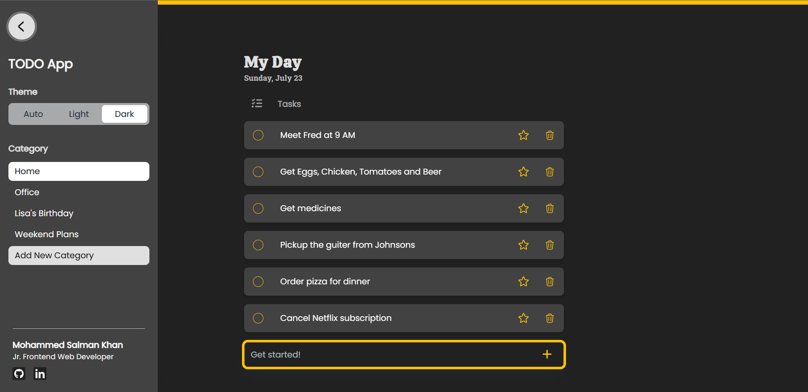
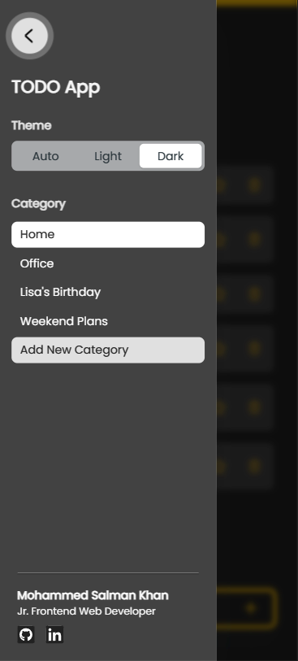
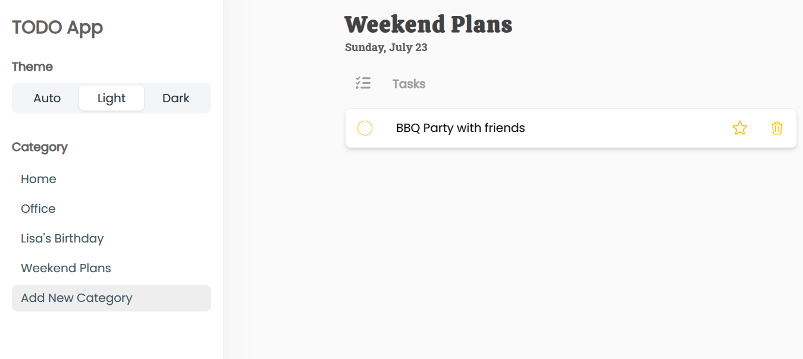
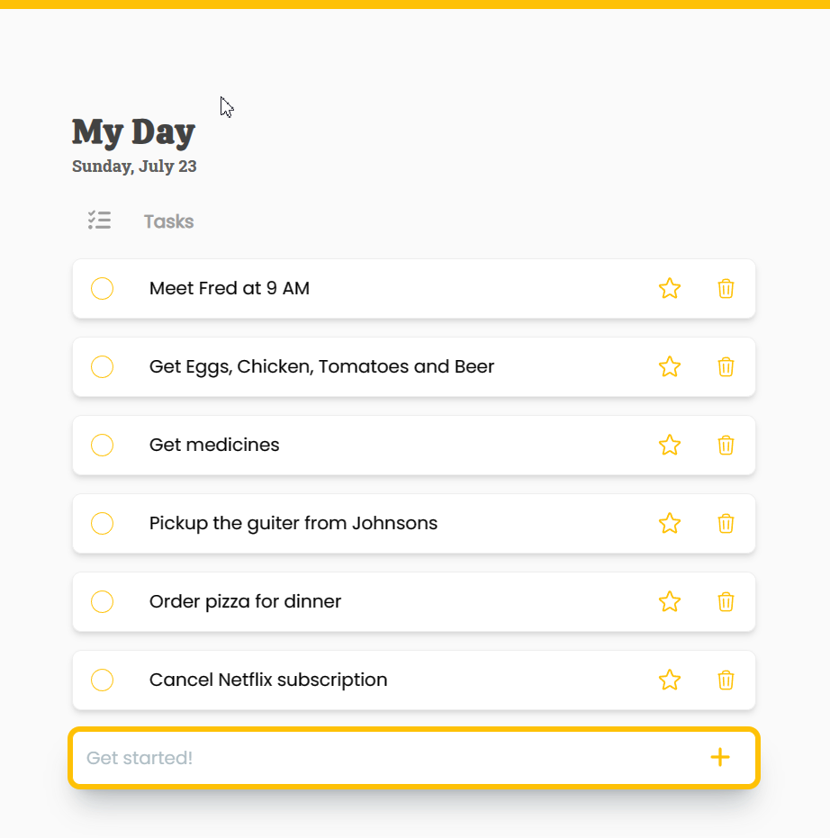

<!-- Replace these using search `repo_name`, `project_title`, `project_description`, view_demo_link -->
<!-- Improved compatibility of back to top link: See: https://github.com/othneildrew/Best-README-Template/pull/73 -->
<a name="readme-top"></a>

<!-- PROJECT SHIELDS -->
<!--
*** https://www.markdownguide.org/basic-syntax/#reference-style-links
-->
<!-- [![Contributors][contributors-shield]][contributors-url]
[![Forks][forks-shield]][forks-url]
[![Stargazers][stars-shield]][stars-url]
[![Issues][issues-shield]][issues-url]
[![MIT License][license-shield]][license-url]
[![LinkedIn][linkedin-shield]][linkedin-url] -->

<!-- PROJECT LOGO -->
<br />

<div align="center">
  <a href="https://github.com/webdevsk/react-todo-app">
    
  </a>

<h3 align="center">React TODO App</h3>

  <p align="center">
    A TODO App based on React with dynamic Routing.
    <br />

  [**Explore the docs »**](https://github.com/webdevsk/react-todo-app)

  [View Demo](https://celadon-cactus-42acbb.netlify.app/)
  · [Report Bug](https://github.com/webdevsk/react-todo-app/issues)
  · [Request Feature](https://github.com/webdevsk/react-todo-app/issues)
  </p>
</div>

---
<!-- TABLE OF CONTENTS -->
<details>
<summary>Table of Contents</summary>
<br />

- [About The Project](#about-the-project)
  - [Built With](#built-with)
- [Getting Started](#getting-started)
  - [Prerequisites](#prerequisites)
  - [Installation](#installation)
- [Features](#features)
- [Contributing](#contributing)
- [License](#license)
- [Contact](#contact)

</details>
<br/>

<!-- ABOUT THE PROJECT -->
## About The Project

<div align="center">

[](https://celadon-cactus-42acbb.netlify.app/)

</div>
<br/>

- This is a simple TODO APP built with React.
- It was built with handheld device accessibility in mind. Hence the bottom Input field.
- It features dynamic routing and dynamic category using React Router.
- Light, Dark and Auto theme. The auto theme follows system preferences.
- Here's what users can expect from this APP:
  - Create Category for different types of tasks.
  - Create tasks for the respective category.
  - Mark completed task as done.
  - Bulk Mark all tasks as done.
  - Delete task.
  - Bulk delete completed tasks.
  - Mark task as important.
  - Important tasks get pinned to top.
  - Users can visit site_url/Groceries and add tasks directly to a category named Groceries.
  - Nice little rewarding animations when a task is completed. 😉

<h4>⭐ Head over to the <a href="#features">Features</a> section to dive deep into the problems I faced and how I solved them.</h4>

<p align="right">(<a href="#readme-top">back to top</a>)</p>

### Built With

[![React][React]][React-url]  
[![React-router][React-router]][React-router-url]  
[![TailwindCSS][TailwindCSS]][Tailwind-url]  
[![MUI][MUI]][MUI-url]  

<p align="right">(<a href="#readme-top">back to top</a>)</p>

<!-- GETTING STARTED -->
## Getting Started

🌐 The site is already live at: [https://celadon-cactus-42acbb.netlify.app/](https://celadon-cactus-42acbb.netlify.app/)

OR

🖥️ You can test it on your local machine by following the steps below.

### Prerequisites

1. **Install** [NODE.JS](https://nodejs.org/en/download) and [Git](https://git-scm.com/downloads)
1. Open your projects base folder and launch any **terminal** of your choice.
1. Run this command:

   ```sh
   npm install npm@latest -g
   ```

### Installation

<!-- 1. Get a free API Key at [https://example.com](https://example.com) -->
1. Clone the repo

    ```sh
    git clone https://github.com/webdevsk/react-todo-app.git
    ```

1. Install NPM packages

    ```sh
    npm install
    ```

1. Run Dev server

    ```js
    npm run dev
    ```

<p align="right">(<a href="#readme-top">back to top</a>)</p>

<!-- USAGE EXAMPLES -->
## Features

<table>
    <tr valign="bottom">
    <td>
    <a href="#"></a>
    <p align="center"><small>Desktop</small></p>
    </td>
    <td>
    <a href="#"></a>
    <p align="center"><small>Mobile</small></p>
    </td>
    </tr>
  </table>

<details>
  <summary><h3>⭐ Handheld accessible layout</h3></summary>

- The input field is placed at the bottom making it is easily reachable on handheld devices.
- Unlike most other Todo Apps, it featues top to bottom (old to new) layout.
- As you add new tasks, the newer tasks will appear at the bottom.
- The page will scroll down automatically to keep newer tasks in focus.

  <details>
  <summary>
  <strong>⚒️ Here's a snippet of code on how I solved the scroll issue:</strong>
  </summary>

  ```jsx
  const {tasks, category} = useLoaderData()

  //Length of the task array before new task is added
  const prevLength = useRef(tasks.length)

  useEffect(() => {
    // Run only when new task is added
    if (prevLength.current < tasks.length){
      window.scrollTo({ left: 0, top: document.body.scrollHeight || document.documentElement.scrollHeight, behavior: "smooth" })
    }
    //Setting new task array length after new task is added
    prevLength.current = tasks.length
  }, [tasks])
  ```
  
  </details>

</details>

<details>
  <summary><h3>⭐ Dynamic Drawer Menu</h3></summary>

- Larger screens
  - Side Drawer Menu can stay either Shown or Hidden based on user's preference.
  - The shown/hidden state is persisted between browsing sessions.
  - Clicking outside the menu will not close it.

- Smaller screens (1400px or less)
  - Side Drawer Menu will always be Hidden unless user opens it.
  - Window size is consistently being monitored to check if the window goesbelow 1400px. If so the menu will hide automatically.
  - Clicking outside the menu will close it.
  <details>
  <summary>
  <strong>⚒️ Here's a snippet of code on how I solved it:</strong>
  </summary>

  ```jsx
  //Initial state. Defaults to false on smaller screens
  const [open, setOpen] = useState(() => (
    window.outerWidth <= 1400
    ? false
    : 'drawerOpen' in localStorage
    ? true
    : false
  ))

  //Saves state in localStorage
  useEffect(()=> (
    open 
    ? localStorage.setItem('drawerOpen', '1') 
    : localStorage.removeItem('drawerOpen')
  ), [open])

  //Enables overlay on smaller screens. Which blurs outside content and listens to touch events
  const [overlay, setOverlay] = useState(() => window.outerWidth <= 1400)

  //Runs on window resize
  useEffect (()=>{
    let currentWindowWidth = window.outerWidth

    function handleWindowResize(){
      //Run only when the horizontal width changes to avoid firing on keyboard popup on touch devices
      if (window.outerWidth === currentWindowWidth) return
      currentWindowWidth = window.outerWidth

      if (window.outerWidth <= 1400){
        setOpen(false)
        setOverlay(true)
      } else {
        setOverlay(false)
      }
    }
    
    window.addEventListener('resize', handleWindowResize)
    return () => {
      window.removeEventListener('resize', handleWindowResize)
    }
  }, [])
  ```

  </details>

</details>

<details>
  <summary><h3>⭐ Create your own Categories</h3></summary>
  <div align="center">
    
  </div>
  <br/>

- Click on the "Add new category" button and type your desired name for it.
- Press Enter or click on the ✅ (tick) button.
- You will be redirected to a new page where you can add tasks in this category.
- Visit or Bookmark https://celadon-cactus-42acbb.netlify.app/School
  - If you already had tasks in School category, the tasks will be listed. 
  - If you never had a School category, it will generate a new Category where you can add new tasks.
  - You can write any strings in place of "School".
  - If you want to add spaces or symbols in category name, rather create it from the Side Drawer Menu instead.
- To save up space in Database/storage, A category won't be stored unless you have atleast 1 task in it.

</details>

<details>
  <summary><h3>⭐ Bulk Operations</h3></summary>
  <div align="center">
    
  </div>
  <br/>

- Completed all tasks for today? Well, congratulations!!! The "Mark all as completed" button will be handy then.
- No need to clutter the list with already complted tasks. The "Delete All Completed" button will make them go away.

</details>

And many more handmade features, animations here and there...

<p align="right">(<a href="#readme-top">back to top</a>)</p>

<!-- ROADMAP -->
<!-- ## Roadmap

- [ ] Feature 1
- [ ] Feature 2
- [ ] Feature 3
    - [ ] Nested Feature

See the [open issues](https://github.com/webdevsk/react-todo-app/issues) for a full list of proposed features (and known issues).

<p align="right">(<a href="#readme-top">back to top</a>)</p> -->

<!-- CONTRIBUTING -->
## Contributing

Contributions are what make the open source community such an amazing place to learn, inspire, and create. Any contributions you make are **greatly appreciated**.

If you have a suggestion that would make this better, please fork the repo and create a pull request. You can also simply open an issue with the tag "enhancement".
Don't forget to give the project a star! Thanks again!

1. Fork the Project
1. Create your Feature Branch (`git checkout -b feature/AmazingFeature`)
1. Commit your Changes (`git commit -m 'Add some AmazingFeature'`)
1. Push to the Branch (`git push origin feature/AmazingFeature`)
1. Open a Pull Request

<p align="right">(<a href="#readme-top">back to top</a>)</p>

<!-- LICENSE -->
## License

Distributed under the MIT License. See `LICENSE.txt` for more information.

<p align="right">(<a href="#readme-top">back to top</a>)</p>

<!-- CONTACT -->
## Contact

[![Follow on GitHub][GitHub]](https://github.com/webdevsk)
[![Follow on Linkedin][Linkedin]][Linkedin-url]

Project Link: [https://github.com/webdevsk/react-todo-app](https://github.com/webdevsk/react-todo-app)

<p align="right">(<a href="#readme-top">back to top</a>)</p>

<br/>

<!-- ACKNOWLEDGMENTS -->
<!-- ## Acknowledgments

* []()
* []()
* []()

<p align="right">(<a href="#readme-top">back to top</a>)</p> -->

<!-- MARKDOWN LINKS & IMAGES -->
<!-- https://www.markdownguide.org/basic-syntax/#reference-style-links -->
[Linkedin-url]: https://linkedin.com/in/webdevsk
[GitHub]: https://img.shields.io/badge/github-%23121011.svg?style=for-the-badge&logo=github&logoColor=white
[Linkedin]: https://img.shields.io/badge/linkedin-%231E77B5.svg?&style=for-the-badge&logo=linkedin&logoColor=white
[contributors-shield]: https://img.shields.io/github/contributors/webdevsk/react-todo-app.svg?style=for-the-badge
[contributors-url]: https://github.com/webdevsk/react-todo-app/graphs/contributors
[forks-shield]: https://img.shields.io/github/forks/webdevsk/react-todo-app.svg?style=for-the-badge
[forks-url]: https://github.com/webdevsk/react-todo-app/network/members
[stars-shield]: https://img.shields.io/github/stars/webdevsk/react-todo-app.svg?style=for-the-badge
[stars-url]: https://github.com/webdevsk/react-todo-app/stargazers
[issues-shield]: https://img.shields.io/github/issues/webdevsk/react-todo-app.svg?style=for-the-badge
[issues-url]: https://github.com/webdevsk/react-todo-app/issues
[license-shield]: https://img.shields.io/github/license/webdevsk/react-todo-app.svg?style=for-the-badge
[license-url]: https://github.com/webdevsk/react-todo-app/blob/master/LICENSE.txt
[linkedin-shield]: https://img.shields.io/badge/-LinkedIn-black.svg?style=for-the-badge&logo=linkedin&colorB=555
[Next-url]: https://nextjs.org/
[React]: https://img.shields.io/badge/React-20232A?style=for-the-badge&logo=react&logoColor=61DAFB
[React-url]: https://reactjs.org/
[TailwindCSS]: https://img.shields.io/badge/tailwindcss-%2338B2AC.svg?style=for-the-badge&logo=tailwind-css&logoColor=white
[Tailwind-url]: https://tailwindcss.com/
[Bootstrap]: https://img.shields.io/badge/bootstrap-%238511FA.svg?style=for-the-badge&logo=bootstrap&logoColor=white
[Bootstrap-url]: https://react-bootstrap.netlify.app/
[SASS]: https://img.shields.io/badge/SASS-hotpink.svg?style=for-the-badge&logo=SASS&logoColor=white
[SASS-url]: https://sass-lang.com/
[Chakra]: https://img.shields.io/badge/chakra-%234ED1C5.svg?style=for-the-badge&logo=chakraui&logoColor=white
[Chakra-url]: https://chakra-ui.com/
[MUI]: https://img.shields.io/badge/MUI-%230081CB.svg?style=for-the-badge&logo=mui&logoColor=white
[MUI-url]: https://mui.com/
[Styled Components]: https://img.shields.io/badge/styled--components-DB7093?style=for-the-badge&logo=styled-components&logoColor=white
[Styled-url]: https://www.styled-components.com/
[React-router]: https://img.shields.io/badge/React_Router-CA4245?style=for-the-badge&logo=react-router&logoColor=white
[React-router-url]: https://reactrouter.com/
[Redux]: https://img.shields.io/badge/redux-%23593d88.svg?style=for-the-badge&logo=redux&logoColor=white
[Redux-url]: https://redux.js.org/
[Three-js]: https://img.shields.io/badge/threejs-black?style=for-the-badge&logo=three.js&logoColor=white
[Three-js-url]: https://threejs.org/
[GSAP]: https://img.shields.io/badge/green%20sock-88CE02?style=for-the-badge&logo=greensock&logoColor=white
[GSAP-url]: https://greensock.com/gsap/