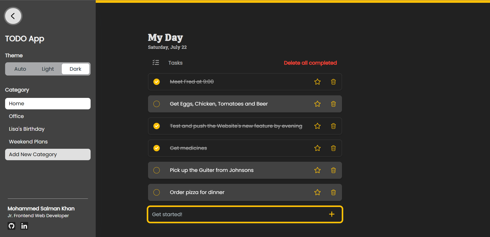

<!-- Replace these using search `repo_name`, `project_title`, `project_description`, view_demo_link -->

<!-- Improved compatibility of back to top link: See: https://github.com/othneildrew/Best-README-Template/pull/73 -->
<a name="readme-top"></a>
<!--
*** Thanks for checking out the Best-README-Template. If you have a suggestion
*** that would make this better, please fork the repo and create a pull request
*** or simply open an issue with the tag "enhancement".
*** Don't forget to give the project a star!
*** Thanks again! Now go create something AMAZING! :D
-->


<!-- PROJECT SHIELDS -->
<!--
*** I'm using markdown "reference style" links for readability.
*** Reference links are enclosed in brackets [ ] instead of parentheses ( ).
*** See the bottom of this document for the declaration of the reference variables
*** for contributors-url, forks-url, etc. This is an optional, concise syntax you may use.
*** https://www.markdownguide.org/basic-syntax/#reference-style-links
-->
[![Contributors][contributors-shield]][contributors-url]
[![Forks][forks-shield]][forks-url]
[![Stargazers][stars-shield]][stars-url]
[![Issues][issues-shield]][issues-url]
[![MIT License][license-shield]][license-url]
[![LinkedIn][linkedin-shield]][linkedin-url]


<!-- PROJECT LOGO -->
<br />
<div align="center">
  <a href="https://github.com/webdevsk/react-todo-app">
    
  </a>

<h3 align="center">React TODO App</h3>

  <p align="center">
    A TODO App based on React with dynamic Routing.
    <br />
    <a href="https://github.com/webdevsk/react-todo-app"><strong>Explore the docs »</strong></a>
    <br />
    <a href="https://celadon-cactus-42acbb.netlify.app/">View Demo</a>
    ·
    <a href="https://github.com/webdevsk/react-todo-app/issues">Report Bug</a>
    ·
    <a href="https://github.com/webdevsk/react-todo-app/issues">Request Feature</a>
  </p>
</div>


<!-- TABLE OF CONTENTS -->
<details>
  <summary>Table of Contents</summary>
  <ol>
    <li>
      <a href="#about-the-project">About The Project</a>
      <ul>
        <li><a href="#built-with">Built With</a></li>
      </ul>
    </li>
    <li>
      <a href="#getting-started">Getting Started</a>
      <ul>
        <li><a href="#prerequisites">Prerequisites</a></li>
        <li><a href="#installation">Installation</a></li>
      </ul>
    </li>
    <li><a href="#features">Features</a></li>
    <li><a href="#roadmap">Roadmap</a></li>
    <li><a href="#contributing">Contributing</a></li>
    <li><a href="#license">License</a></li>
    <li><a href="#contact">Contact</a></li>
    <li><a href="#acknowledgments">Acknowledgments</a></li>
  </ol>
</details>


<!-- ABOUT THE PROJECT -->
## About The Project
<div align="center">
<a href="https://celadon-cactus-42acbb.netlify.app/">

</a>
</div>
<br/>

* This is a simple TODO APP built with React.
* It was built with handheld device accessibility in mind. Hence the bottom Input field.
* It features dynamic routing and dynamic category using React Router.
* Light, Dark and Auto theme. The auto theme follows system preferences.
* Here's what users can expect from this APP:
  * Create Category for different types of tasks.
  * Create tasks for the respective category.
  * Mark completed task as done.
  * Bulk Mark all tasks as done.
  * Delete task.
  * Bulk delete completed tasks.
  * Mark task as important.
  * Users can visit site_url/Groceries and add tasks directly to a category named Groceries.
  * Nice little rewarding animations when a task is completed. 😉

#### ⭐ Head over to the [Features](#features) section to dive deep into the problems I faced and how I solved them.

<p align="right">(<a href="#readme-top">back to top</a>)</p>


### Built With

* [![React][React]][React-url]
* [![React-router][React-router]][React-router-url]
* [![TailwindCSS][TailwindCSS]][Tailwind-url]
* [![MUI][MUI]][MUI-url]

<p align="right">(<a href="#readme-top">back to top</a>)</p>


<!-- GETTING STARTED -->
## Getting Started

🌐 The site is already live at: site_url

_OR_

🖥️ You can test it on your local machine by following the steps below.

### Prerequisites

1. **Install** [NODE.JS](https://nodejs.org/en/download) and [Git](https://git-scm.com/downloads)
1. Open your projects base folder and launch any **terminal** of your choice.
1. Run this command:

   ```sh
   npm install npm@latest -g
   ```

### Installation

<!-- 1. Get a free API Key at [https://example.com](https://example.com) -->
1. Clone the repo
   ```sh
   git clone https://github.com/webdevsk/react-todo-app.git
   ```
1. Install NPM packages
   ```sh
   npm install
   ```
1. Run Dev server
   ```js
   npm run dev
   ```

<p align="right">(<a href="#readme-top">back to top</a>)</p>


<!-- USAGE EXAMPLES -->
## Features

Work in Progress...

<!-- _For more examples, please refer to the [Documentation](https://example.com)_ -->

<p align="right">(<a href="#readme-top">back to top</a>)</p>


<!-- ROADMAP -->
<!-- ## Roadmap

- [ ] Feature 1
- [ ] Feature 2
- [ ] Feature 3
    - [ ] Nested Feature

See the [open issues](https://github.com/webdevsk/react-todo-app/issues) for a full list of proposed features (and known issues).

<p align="right">(<a href="#readme-top">back to top</a>)</p> -->


<!-- CONTRIBUTING -->
## Contributing

Contributions are what make the open source community such an amazing place to learn, inspire, and create. Any contributions you make are **greatly appreciated**.

If you have a suggestion that would make this better, please fork the repo and create a pull request. You can also simply open an issue with the tag "enhancement".
Don't forget to give the project a star! Thanks again!

1. Fork the Project
2. Create your Feature Branch (`git checkout -b feature/AmazingFeature`)
3. Commit your Changes (`git commit -m 'Add some AmazingFeature'`)
4. Push to the Branch (`git push origin feature/AmazingFeature`)
5. Open a Pull Request

<p align="right">(<a href="#readme-top">back to top</a>)</p>


<!-- LICENSE -->
## License

Distributed under the MIT License. See `LICENSE.txt` for more information.

<p align="right">(<a href="#readme-top">back to top</a>)</p>


<!-- CONTACT -->
## Contact

[![Follow on GitHub][GitHub]](https://github.com/webdevsk)
[![Follow on Linkedin][Linkedin]][Linkedin-url]

Project Link: [https://github.com/webdevsk/react-todo-app](https://github.com/webdevsk/react-todo-app)

<p align="right">(<a href="#readme-top">back to top</a>)</p>

<br/>

<!-- ACKNOWLEDGMENTS -->
<!-- ## Acknowledgments

* []()
* []()
* []()

<p align="right">(<a href="#readme-top">back to top</a>)</p> -->


<!-- MARKDOWN LINKS & IMAGES -->
<!-- https://www.markdownguide.org/basic-syntax/#reference-style-links -->
[Linkedin-url]: https://linkedin.com/in/webdevsk
[GitHub]: https://img.shields.io/badge/github-%23121011.svg?style=for-the-badge&logo=github&logoColor=white
[Linkedin]: https://img.shields.io/badge/linkedin-%231E77B5.svg?&style=for-the-badge&logo=linkedin&logoColor=white
[contributors-shield]: https://img.shields.io/github/contributors/webdevsk/react-todo-app.svg?style=for-the-badge
[contributors-url]: https://github.com/webdevsk/react-todo-app/graphs/contributors
[forks-shield]: https://img.shields.io/github/forks/webdevsk/react-todo-app.svg?style=for-the-badge
[forks-url]: https://github.com/webdevsk/react-todo-app/network/members
[stars-shield]: https://img.shields.io/github/stars/webdevsk/react-todo-app.svg?style=for-the-badge
[stars-url]: https://github.com/webdevsk/react-todo-app/stargazers
[issues-shield]: https://img.shields.io/github/issues/webdevsk/react-todo-app.svg?style=for-the-badge
[issues-url]: https://github.com/webdevsk/react-todo-app/issues
[license-shield]: https://img.shields.io/github/license/webdevsk/react-todo-app.svg?style=for-the-badge
[license-url]: https://github.com/webdevsk/react-todo-app/blob/master/LICENSE.txt
[linkedin-shield]: https://img.shields.io/badge/-LinkedIn-black.svg?style=for-the-badge&logo=linkedin&colorB=555
[Next-url]: https://nextjs.org/
[React]: https://img.shields.io/badge/React-20232A?style=for-the-badge&logo=react&logoColor=61DAFB
[React-url]: https://reactjs.org/
[TailwindCSS]: https://img.shields.io/badge/tailwindcss-%2338B2AC.svg?style=for-the-badge&logo=tailwind-css&logoColor=white
[Tailwind-url]: https://tailwindcss.com/
[Bootstrap]: https://img.shields.io/badge/bootstrap-%238511FA.svg?style=for-the-badge&logo=bootstrap&logoColor=white
[Bootstrap-url]: https://react-bootstrap.netlify.app/
[SASS]: https://img.shields.io/badge/SASS-hotpink.svg?style=for-the-badge&logo=SASS&logoColor=white
[SASS-url]: https://sass-lang.com/
[Chakra]: https://img.shields.io/badge/chakra-%234ED1C5.svg?style=for-the-badge&logo=chakraui&logoColor=white
[Chakra-url]: https://chakra-ui.com/
[MUI]: https://img.shields.io/badge/MUI-%230081CB.svg?style=for-the-badge&logo=mui&logoColor=white
[MUI-url]: https://mui.com/
[Styled Components]: https://img.shields.io/badge/styled--components-DB7093?style=for-the-badge&logo=styled-components&logoColor=white
[Styled-url]: https://www.styled-components.com/
[React-router]: https://img.shields.io/badge/React_Router-CA4245?style=for-the-badge&logo=react-router&logoColor=white
[React-router-url]: https://reactrouter.com/
[Redux]: https://img.shields.io/badge/redux-%23593d88.svg?style=for-the-badge&logo=redux&logoColor=white
[Redux-url]: https://redux.js.org/
[Three-js]: https://img.shields.io/badge/threejs-black?style=for-the-badge&logo=three.js&logoColor=white
[Three-js-url]: https://threejs.org/
[GSAP]: https://img.shields.io/badge/green%20sock-88CE02?style=for-the-badge&logo=greensock&logoColor=white
[GSAP-url]: https://greensock.com/gsap/